# Data Analysis

- 원시(원본 그대로) 데이터를 분석하여 인사이트(가시성 증가 및 깊은 이해)로 변환하는 작업이다.
- 문제를 해결하기 위해 데이터를 사용해서 흐름 및 방향을 찾는 기술이다.
- 데이터 분석을 통해 비지니스 프로세스를 구성하고, 의사 결정을 개선하며, 비지니스 성장을 증진할 수 있다.

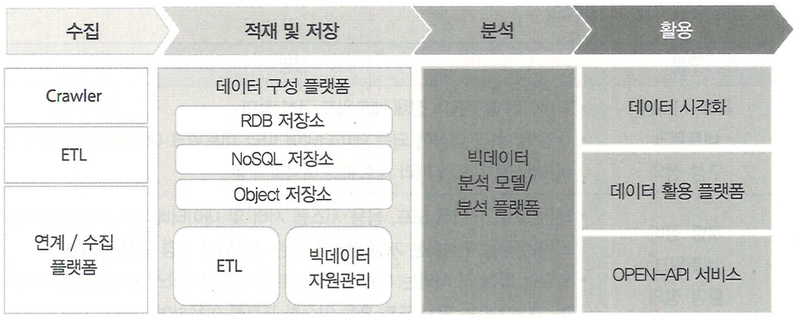
** <sub>ETL은 Extract(추출), Transform(변환), Load(적재)를 의미한다. 여기 저기 흩어진 데이터를 하나로 모으기 위한 결합 과정이다.</sub>

## 기초 통계 (Basic statistics)

📌 통계는 아직 발생하지 않은 일을 예측하기 위해 사용한다.

- 통계학을 공부하는 데 있어 필요한 기본 개념이고,  
  수량적인 비교를 기초로 많은 사실을 관찰하고 처리하는 방법을 연구하는 학문이다.
- 불균형 데이터를 대상으로 규칙성과 불규칙성을 발견한 뒤 실생활에 적용할 수 있다.

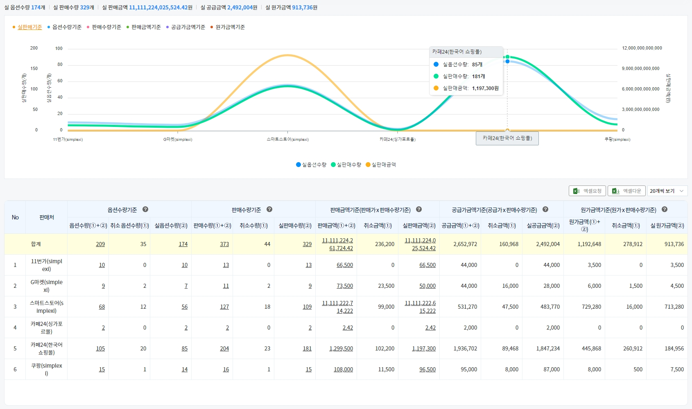

### 변량(Variable)
- 자료의 수치를 변량이라고 하며, 이는 데이터의 값을 의미한다.

### 계급 (Class)
- 변량을 일정 간격으로 나눈 구간을 의미한다.
- 변량의 최소값과 최대값을 잘 고려해서 계급을 정해야한다.
- 예를 들어, 계급이 (150, 160]일 경우, 151 ~ 160이 계급에 속한다. 즉 소괄호는 구간 미포함, 대괄호는 구간 포함이다.

### 상대 도수
- 각 계급에 속하는 변량의 비율을 의미한다.

### 산술 평균 (Mean)
- 변량의 합을 변량의 수로 나눈 값을 의미한다.

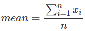

### 분산 (Variance)
- 변량이 평균으로부터 떨어져있는 정도를 보기 위한 통계량이다.
- 편차에 제곱하여 그 합을 구한 뒤 산술 평균을 낸다.

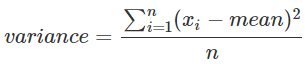

### 표준편차 (Standard deviation)
- 분산의 제곱근이며, 관측된 변량의 흩어진 정도를 하나의 수치로 나타내는 통계량이다.
- 표준편차가 작을 수록 평균 값에서 변량들의 거리가 가깝다고 판단한다.

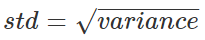

#### 범주형 확률변수 (Categorical random variable)
- 범주형 확률변수값은 수치가 아닌 기호나 언어, 숫자등으로 표현하고, 기호나 언어는 순서를 가질 수도 있다.
- 유한집합으로 표현한다. 유한집합은 원소의 수가 유한한 집합을 의미한다.
- {앞면, 뒷면}, {동의, 비동의}, {선택, 미선택}, {봄, 여름, 가을, 겨울}

#### 이산형 확률변수 (Discrete random variable)
- 이산형 확률변수값은 수치로 표현하고 셀 수 있는 값이다. 이를 더 넓은 범위로,  
  양적 확률변수 또는 수치형 확률변수라고도 부른다.
- 유한집합 또는 셀 수 있는 무한집합으로 표현한다. 무한집합은 원소의 수가 무한한 집합을 의미한다.
- {0, 1, 2, 3}, {10, 20, 30}, {1, 2, 3, ...}, {100, 1000, 10000}

#### 연속형 확률변수 (Continuous random variable)
- 연속형 확률변수는 구간을 나타내는 수치로 표현한다. 이를 더 넓은 범위로,  
  양적 확률변수 또는 수치형 확률변수라고도 부른다.
- 셀 수 없는 무한집합으로 표현한다.
- 128.56 < X < 268.56

#### 확률분포 (Probability distribution)
- 사건에 대한 확률변수에서 정의된 모든 확률값의 분포이며, 서로 다른 모든 결과의 출현 확률을 제공한다.
  
> <strong>1) 동전 던지기 (시행)</strong>  
> <strong>2) { 0, 1 } (확률변수와 확률변수값)</strong>  
> <strong>3) 완벽한 형태의 동전일 경우 확률 분포</strong>  
>
> 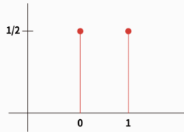  

  
> <strong>1) 1 ~ 12까지 새겨진 주사위 던지기 (시행)</strong>  
> <strong>2) { 1, 2, 3, 4, 5, 6, 7, 8, 9, 10, 11, 12 } (확률변수와 확률변수값)</strong>  
> <strong>3) 완벽한 형태의 주사위일 경우 확률 분포</strong>  
>
> 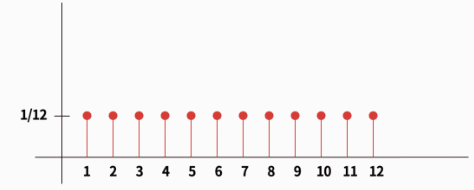

#### 확률분포표 (Probability distribution table)
- 확률변수의 모든 값(원소)에 대해 확률을 표로 표시한 것이다.
- 범주형 또는 이산형 확률변수의 확률분포를 표현하기에 적합한 방식이다.

#### 확률분포함수 (Probability distribution function)
- 확률변수의 분포를 나타내는 함수로서, 확률변수의 확률변수값이 나올 확률을 나타내는 함수이다.
- 확률질량함수, 확률밀도함수 등의 함수가 있다.

#### 확률질량 함수 (Probability mass function, pmf)
- 확률변수 X의 분포를 나타내는 함수로서, x<sub>i</sub>가 나올 확률이다.
- 확률변수의 값을 매개변수로 전달받고, 해당 값이 나타날 확률을 구해서 리턴하는 함수이다.
- 범주형 확률변수와 이산형 확률변수에서 사용된다.
- 확률변수에서 각 값에 대한 확률을 나타내는 것이 마치 각 값이 "질량"을 가지고 있는 것처럼 보이기 때문에 확률질량 함수로 불린다.

> 확률질량 함수 f는 확률변수 X가 x를 변수값으로 가질 때의 확률이다.  
> 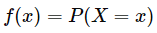  
> 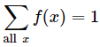  
>   

#### 무한대 (Infinity)
- 끝없이 커지는 상태를 의미하고 기호로 ∞를 사용한다.

#### 무한소 0 (Infinitesimal)
- 거의 없다는 의미이고, 0에 매우 근접하지만 0이 아닌 상태를 의미한다.

#### 미분 (Differential)
- 기울기는 독립변수가 종속변수에 미치는 영향력의 크기를 의미한다.
- 변경 전의 독립변수 x<sub>1</sub>이라는 점과 변경 후의 x<sub>2</sub>라는 점을 지나는 직선의 기울기가 바로 변화에 대한 속도이다.
- 즉, 직선의 기울기가 4로 구해졌다면,  
  종속변수가 독립변수의 변화에 4배 속도로 변화된 것이다.
- 이 때, 두 점 사이가 무한히 가까워지면,  
  결국 거의 한 점과 같은 점에 대한 접선의 기울기가 되고 이는 순간적인 변화량이다.
- 미분을 통해서 독립변수가 미세하게 변화할 때 순간적으로 종속변수가 얼마나 빠르게 변화하는 지를 알 수 있다.

#### 적분 (Integral)
- 선분 = 높이(길이), 면적 = 가로 X 높이
- 면적을 구할 때 여러 사각형으로 나눈 뒤 합하여도 전체 면적이 나온다.
- 가로가 무한소 0인 사각형 즉, 선분과 거의 비슷한 사각형을 쌓은 뒤, 각 면적을 모두 합하는 것이 적분이다.

#### 확률밀도 함수 (Probability density function, pdf)
- 확률변수 X의 분포를 나타내는 함수로서, 특정 구간에 속할 확률이고 이는 특정 구간을 적분한 값이다.
- 확률변수값의 범위(구간)를 매개변수로 전달받고, 범위의 넓이를 구해서 리턴하는 함수이다.
- 연속형 확률변수에서 사용된다.
- 전체에 대한 확률이 아닌 구간에 포함될 확률을 나타내기 때문에 구간에 따른 밀도를 구하는 것이고,  
  이를 통해 확률밀도 함수라 불린다.

> 확률밀도 함수 f는 특정 구간에 포함될 확률을 나타낸다.  
> 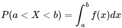  
> 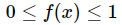  
> 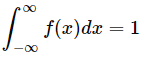  
> 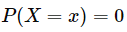
> 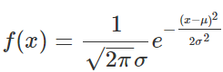

#### 정규분포 (Normal distribution)
- 모든 독립적인 확률변수들의 평균은 어떠한 분포에 가까워지는데, 이 분포를 정규분포라고 한다.
- 즉, 비정규분포의 대부분은 극한상태에 있어서 정규분포에 가까워진다.

<div>
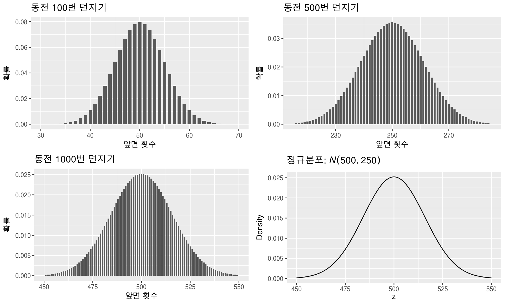 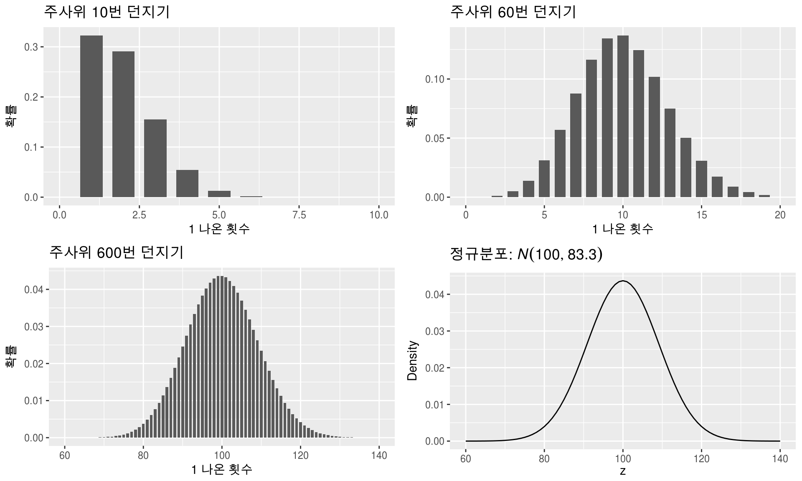  
</div>  

- 평균 μ(mu)와 표준편차 σ(sigma)에 대해 아래의 확률밀도함수를 가지는 분포를 의미한다.  
- 평균을 중심으로 발생하는 무작위 오차를 시각화 한 것이 정규 분포이다.
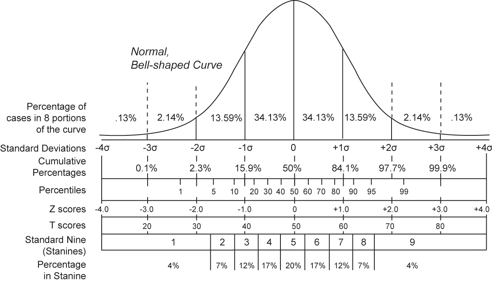

#### 표준 정규분포 (Standard normal distribution)
- 정규분포는 평균과 표준편차에 따라서 모양이 달라진다.

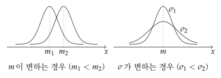  

- 정규분포를 따르는 분포는 많지만 각 평균과 표준편차가 달라서 일반화할 수 없다.
- N(μ, σ) = N(0, 1)로 만든다면 모두 같은 특성을 가지는 동일한 확률분포로 바꿔서 일반화할 수 있다.
- 따라서 일반 정규분포를 표준 정규분포로 바꾼 뒤 표준 정규분포의 특정 구간의 넓이를 이용해서 원래 분포의 확률을 구할 수 있다.

#### 표준화 (Standardization)
- 다양한 형태의 정규분포를 표준 정규분포로 변환하는 방법이다.
- 표준 정규분포에 대한 값(넓이)를 이용해 원래 분포의 확률을 구할 수 있다.  

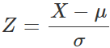  

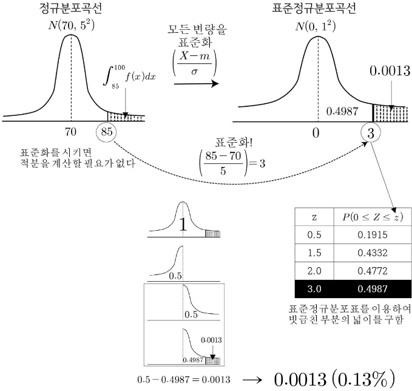

#### 모집단과 모수 (Population and population parameter)
- 모집단이란, 정보를 얻고자 하는 대상의 전체 집합을 의미한다.
- 모수란, 모집단의 수치적 요약값을 의미한다. 평균 또는 표준편차와 같은 모집단의 통계값을 모수라고 한다.

---
# Numpy

> 📓 실습 파일: [a_numpy.ipynb](./a_numpy.ipynb)

```python
import numpy as np

print(np.__version__)
```

머신러닝 애플리케이션에서 데이터 추출, 가공, 변환과 같은 데이터 처리 부분을 담당한다.  
넘파이 기반의 사이킷런을 이해하기 위해서 넘파이는 필수이다.  
넘파이 전체를 다 이해하고 공부하는 것보다 **기본 문법과 중요 API만 이해하는 것**이 전략적으로 좋다.

---

## ndarray

N차원(n-dimension) 배열 객체이다.  
파이썬 list를 `array()` 메소드에 전달하면 ndarray로 변환되고 넘파이의 다양하고 편리한 기능들을 사용할 수 있게 된다.  
반드시 **같은 자료형의 데이터**만 담아야 한다.

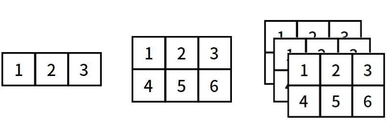

```python
import numpy as np

ndarray1 = np.array([1, 2, 3])
print(type(ndarray1), ndarray1, sep='\n')

print(ndarray1.shape)
print(ndarray1.ndim)
```

```python
ndarray2 = np.array([[1, 3, 5], [2, 4, 6]])
print(type(ndarray2), ndarray2, sep='\n')

print(ndarray2.shape)
print(ndarray2.ndim)
```

---

## astype()

ndarray에 저장된 요소의 타입을 변환시킬 때 사용한다.  
대용량 데이터 처리 시, 메모리 절약을 위해 사용한다.

```python
ndarray1 = np.array([1, 2, 3])
print(type(ndarray1))
print(ndarray1.dtype)

ndarray1_int8 = ndarray1.astype(np.int8)
print(type(ndarray1_int8))
print(ndarray1_int8.dtype)
```

```python
# 4, 5, 6을 ndarray에 담는다.
# dtype을 확인한 뒤 float16으로 변경하고 확인한다.
ndarray1 = np.array([4, 5, 6])
print(type(ndarray1))
print(ndarray1.dtype)
print(ndarray1)

ndarray1_float16 = ndarray1.astype(np.float16)
print(type(ndarray1_float16))
print(ndarray1_float16.dtype)
print(ndarray1_float16)
```

```python
# 1 ~ 10까지의 요소를 ndarray에 담는다.
# 각 요소에 5씩 더한다.
ndarray1 = np.array(range(1, 11))
ndarray1 + 5
```

---

## axis

축의 방향성을 표현할 때 axis로 표현할 수 있다.

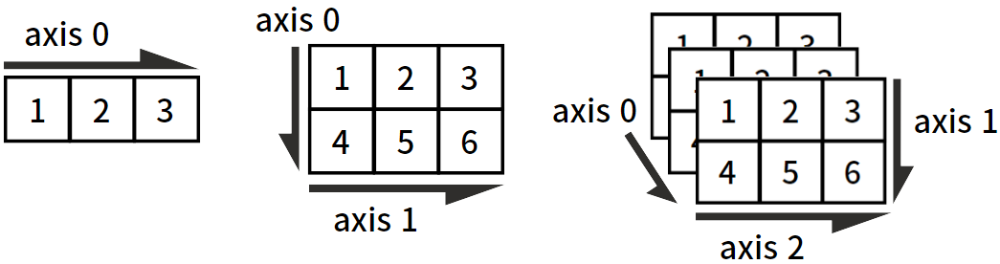

---

## arange(), zeros(), ones()

ndarray의 요소를 원하는 범위의 연속값, 0 또는 1로 초기화할 때 사용한다.

```python
import numpy as np

# 0 ~ 9까지 1차원 ndarray
ndarray1 = np.arange(0, 10, dtype=np.float16)
print(ndarray1.shape)
print(ndarray1)

# 2행 3열 요소 모두 0으로 초기화
ndarray2 = np.zeros((2, 3), dtype=np.float16)
print(ndarray2.shape)
print(ndarray2)

# 1차원 3칸 배열 요소 모두 1로 초기화
ndarray1 = np.ones((3,), dtype=np.int8)
print(ndarray1.shape)
print(ndarray1)
```

---

## reshape()

ndarray의 기존 shape를 다른 shape로 변경한다.

```python
ndarray1 = np.arange(8)
print(ndarray1.shape)

ndarray2 = ndarray1.reshape((2, 4))
print(ndarray2.shape)

# ndarray1의 차원을 2차원 2열로 변경
ndarray2 = ndarray1.reshape((-1, 2))
print(ndarray2.shape)

# ndarray1을 2차원 1열로 변환
ndarray2 = ndarray1.reshape((-1, 1))
print(ndarray2.shape)

# 1차원으로 바꾸기
ndarray2.flatten()
```

```python
import numpy as np

# axis 0이 10인 shape이면서 모든 원소가 0, dtype은 int32인 ndarray 만들기
ndarray1 = np.zeros((10, ), dtype=np.int32)
print(ndarray1, ndarray1.shape, sep='\n')

# axis 0이 3, axis1이 4인 shape이면서 모든 원소가 1인 ndarray 만들기
ndarray2 = np.ones((3, 4))
print(ndarray2, ndarray2.shape, sep='\n')

# axis 0이 5, 각 요소가 0~4인 ndarray 만들기
ndarray1 = np.arange(5)
print(ndarray1, ndarray1.shape, sep='\n')

# 아래의 ndarray1이 주어졌을 때 순서대로 문제를 해결한다.
ndarray1 = np.arange(start=0, stop=16)
print(ndarray1, ndarray1.shape, sep='\n')

# 2 Dimension, axis 1은 2로 변경
ndarray2 = ndarray1.reshape((-1, 2))
print(ndarray2, ndarray2.shape, sep='\n')

# 2 Dimension, axis 0은 8로 변경
ndarray2 = ndarray1.reshape((8, -1))
print(ndarray2, ndarray2.shape, sep='\n')

# 3 Dimension으로 변경
ndarray3 = ndarray1.reshape((4, 2, -1))
print(ndarray3, ndarray3.shape, sep='\n')

# ndarray3을 axis 1이 1인 2차원 ndarray로 변환
ndarray2 = ndarray3.reshape((-1, 1))
print(ndarray2, ndarray2.shape, sep='\n')

# ndarray3을 1 Dimension으로 변환
ndarray1 = ndarray3.flatten()
print(ndarray1, ndarray1.shape, sep='\n')
```

---

## Indexing

특정 위치의 데이터를 가져오는 방법이다.

| 종류 | 설명 |
|------|------|
| **위치 인덱싱** (Location indexing) | 인덱스 번호로 특정 요소 접근 |
| **슬라이싱** (Slicing) | `[start:end]` 범위로 요소 추출 |
| **팬시 인덱싱** (Fancy indexing) | 인덱스 배열을 이용한 요소 추출 |
| **불린 인덱싱** (Boolean indexing) | 조건식을 이용한 요소 추출 |

```python
# 위치 인덱싱
ndarray1 = np.arange(2, 11)
print(ndarray1, ndarray1.shape, sep='\n')

data = ndarray1[2]
print(data)

data = ndarray1[-2]
print(data)

ndarray1[-3] = 100
print(ndarray1)

ndarray1 = np.arange(1, 10)
ndarray2 = ndarray1.reshape(3, -1)
print(ndarray2)

data = ndarray2[0, 2]
print(data)
```

```python
# 슬라이싱
ndarray1 = np.arange(2, 10, 2)
print(ndarray1)

print(ndarray1[:3])
print(ndarray1[1:])
print(ndarray1[:])
print(ndarray1[:-1])

ndarray1 = np.arange(1, 28)
ndarray2 = ndarray1.reshape((-1, 3))
print(ndarray2)

print(ndarray2[:3])
print(ndarray2[:3, :2])
print(ndarray2[::-1])
print(ndarray2[::-1, ::-1])
print(ndarray2[:3, :])
```

```python
# 팬시 인덱싱
ndarray1 = np.arange(1, 21)
print(ndarray1[[1, 4]])

ndarray2 = ndarray1.reshape(4, -1)
print(ndarray2)

print(ndarray2[[0, 1, 3], 2:])
```

```python
# 불린 인덱싱
ndarray1 = np.arange(1, 101, 3)
print(ndarray1)

# ndarray에서의 논리연산자: &, |, ~
ndarray1[ndarray1 % 5 == 0]
```

```python
# 2행의 4번째 숫자 출력
ndarray1 = np.arange(start=1, stop=21)
ndarray2 = ndarray1.reshape((5, -1))
print(ndarray2)
print(ndarray2[1, 3])

# 1~100 중 짝수만 출력
ndarray1 = np.arange(1, 101)
ndarray1_even = ndarray1[ndarray1 % 2 == 0]
print(ndarray1_even)

# 위에서 구한 짝수들을 axis 0이 10인 2차원 배열로 변환 후 82~100까지 추출
ndarray2_even = ndarray1_even.reshape((10, -1))
print(ndarray2_even[-2:])

# 아래의 ndarray1 요소 중 1의 자리수가 2인 수들만 추출하기
ndarray1 = np.arange(start=1, stop=101)
print(ndarray1[ndarray1 % 10 == 2])

# 1~49요소 중 2와 5의 공배수 추출하기
ndarray1 = np.arange(1, 50)

condition1 = ndarray1 % 2 == 0
condition2 = ndarray1 % 5 == 0
condition = condition1 & condition2

result = ndarray1[condition]
print(result)

# 위에서 추출한 공배수 중 20이상인 값만 추출하기
print(result[result >= 20])
```

---

## Sorting

모두 오름차순 정렬이며, 내림차순은 오름차순 정렬 후 `[::-1]`을 붙여 사용한다.

```python
import numpy as np

original_ndarray = np.array([0, 4, 2, 5])
sorted_ndarray = np.sort(original_ndarray)

print(f'원본: {original_ndarray}')
print(f'오름차순: {sorted_ndarray}')
print(f'내림차순: {sorted_ndarray[::-1]}')
```

```python
ndarray1 = np.arange(20, 0, -2)
ndarray2 = ndarray1.reshape((2, -1))
print(ndarray2)

# axis0: 행방향, 세로
sorted_ndarray_axis0 = np.sort(ndarray2, axis=0)
print(f'axis=0 정렬\n{sorted_ndarray_axis0}')

# axis1: 열방향, 가로
sorted_ndarray_axis1 = np.sort(ndarray2, axis=1)
print(f'axis=1 정렬\n{sorted_ndarray_axis1}')
```

```python
original_ndarray = np.array([0, 4, 2, 5])
sorted_indices = np.argsort(original_ndarray)

print(sorted_indices)
print(original_ndarray[sorted_indices])
```

```python
# 제로백이 빠른 순으로 자동차 이름 정렬하기
cars = np.array(['Lamborghini', 'Mclaren', 'Benz', 'Bentley', 'The New Morning'])
zero100 = np.array([2.8, 2.9, 5.2, 3.7, 13.5])
cars[np.argsort(zero100)]
```

```python
# 데이터를 분석하여, 가격을 기준으로 오름차순 및 내림차순 후 과일 이름을 출력하세요.
fruit_list = [['Mango', 'Apple', 'Pear', 'Pitch', 'Melon'], [1500, 1800, 2000, 2500, 8500]]

ndarray2 = np.array(fruit_list)
fruit_name = ndarray2[0]
fruit_price = ndarray2[-1]

print(fruit_name[fruit_price.argsort()])
print(fruit_name[fruit_price.argsort()[::-1]])
```

---

## 벡터 (Vector)

데이터 과학에서 벡터란 숫자 자료를 나열한 것을 의미하며, 공간에서 한 점을 나타낸다.  
feature 1개당 1차원이고, feature가 3개면 3차원이다.

---

### 내적 (Dot product)

두 벡터의 성분들의 곱의 합이다.  
앞 행렬의 열 개수와 뒤 행렬의 행 개수가 일치해야 한다.

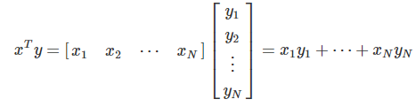

```python
import numpy as np

a = np.array([1, 2, 3, 4]).reshape(2, 2)
b = np.array([5, 6]).reshape(2, 1)

print(a)
print(b)

# np.dot(a, b)
a @ b
```

```python
# 전치 행렬
ndarray1 = np.arange(1, 5).reshape(2, 2)
ndarray1.T
```

```python
import numpy as np

ndarray1 = np.arange(1, 5).reshape(2, 2)
print(ndarray1)

# 역행렬
ndarray1_inv = np.linalg.inv(ndarray1)
print(ndarray1_inv)

# 단위 행렬
print(np.round(ndarray1 @ ndarray1_inv).astype(np.int8))
```

---

### 선형대수 (Linear Algebra)

선형 방정식을 풀기 위해 배우는 학문이다.  
연립 방정식을 행렬로 표현하여 역행렬을 이용해 해를 구할 수 있다.

```python
# x + y = 10
# 2x - 3y = 10

# Aw = b
A = np.array([[1, 1], [2, -3]])
b = np.array([[10, 10]])
w = np.linalg.inv(A) @ b.T

print(w)
```

```python
# x + 2y + 3z = 1
# x + 2y + z  = 3
# x + 3z      = 5

# Aw = b
A = np.array([[1, 2, 3], [1, 2, 1], [1, 0, 3]])
b = np.array([[1, 3, 5]])
w = np.linalg.inv(A) @ b.T
w
```

---

### 과결정계 (Overdetermined system)

미지수보다 방정식이 더 많이 있는 연립방정식으로서 보통 해가 존재하지 않는다.  
교점과 가장 가까운 거리의 점을 찾고, 투영을 통해 해당 차원으로 축소하여 해의 근사치를 구할 수 있다.  
투영 시 원본 값에서 어느 정도의 loss(손실)가 발생하지만 이를 감안하고 근사값을 구한다.

```python
# 최소제곱법(최소근사법)
# x + 2y + 3z =  1
# x + 2y + z  =  3
# x + 3z      =  5
# x + 5y + 2z = 55

import numpy as np

A = np.array([[1, 2, 3],
              [1, 2, 1],
              [1, 0, 3],
              [1, 5, 2]])

b = np.array([1, 3, 5, 55])

x, residuals, _, _ = np.linalg.lstsq(A, b)
print(x)
print(residuals)
```

---

# Pandas
 
> 📓 실습 파일: [a_pandas.ipynb](./a_pandas.ipynb)
 
```python
# %pip install pandas
 
import pandas as pd
 
pd.__version__
```
 
데이터 처리 라이브러리 중 가장 인기있는 라이브러리이다.  
2차원 데이터(테이블, 엑셀, CSV 등)를 효율적으로 가공 및 처리할 수 있다.
 
| 구성 요소 | 설명 |
|-----------|------|
| **DataFrame** | 행과 열로 구성된 2차원 Dataset |
| **Series** | 1개의 열로만 구성된 열벡터 Dataset |
| **Index** | DataFrame과 Series에서 중복없는 행 번호 |
 
---
 
## DataFrame()
 
dict를 DataFrame으로 변환하고자 할 때 DataFrame 생성자에 전달한다.  
컬럼명을 추가하거나 인덱스명을 변경하는 등 다양하게 설정할 수 있다.

---

# Visualization(시각화)
 
> 📓 실습 파일: [a_visualization.ipynb](./a_visualization.ipynb)

## https://matplotlib.org/stable/plot_types/index.html

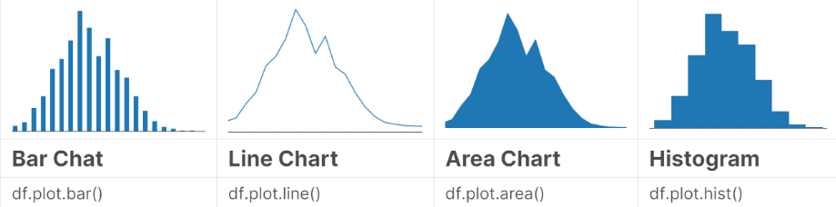
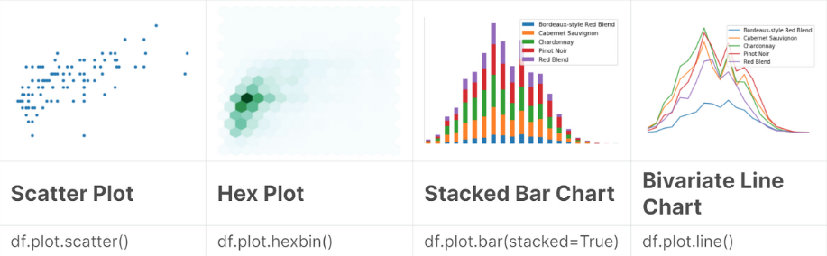
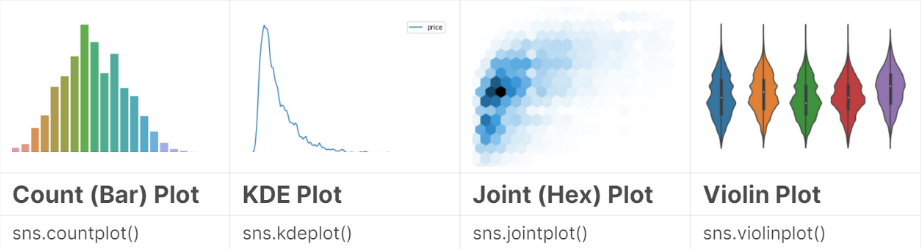
  
#### 범주형(상품 카테고리: 생활용품, 전자제품, 의류, 학생 수준: High, Medium, Low, 측정년도: 2021, 2022, ...)
- 바이올린 차트
- 스캐터 플롯
- 막대 차트
- 누적 막대 차트
  
#### 수치형(학번: 1, 2,..., 구매 횟수: 157, 789, ..., 가격: 1280.15648, ..., 식물의 높이: 10.251, ...)
- 막대 차트(숫자가 적을 경우)
- 선 그래프(숫자가 많을 경우)
- 바이올린 차트
- 스캐터 플롯
- 히스토그램
- KDE

---

# RFM
 
> 📓 실습 파일: [a_rfm.ipynb](./a_rfm.ipynb)

## RFM 분석  

사용자별로 얼마나 최근에, 얼마나 자주, 얼마나 많은 금액을 지출했는지에 따라 사용자들의 분포를 확인하거나  
사용자 그룹(또는 등급)을 나누어 분류하는 분석 기법이다. 구매 가능성이 높은 고객을 선정할 때 용이한 데이터 분석 방법이며,  
사용자들의 평소 구매 패턴을 기준으로 분류를 진행하기 때문에 각 사용자 그룹의 특성에 따라  
차별화된 마케팅 메세지를 전달할 수 있다.  

- Recency: 얼마나 최근에 구매했는가
- Frequency: 얼마나 자주 구매했는가
- Monetary: 얼마나 많은 금액을 지출했는가

### 🛒이커머스 플랫폼 A기업의 RFM 분석
📌이커머스: 온라인을 통해 상품이나 서비스를 사고파는 서비스 (쿠팡, 11번가, 네이버 등)

 
<table style="width: 50%; margin-left:10px;">
    <caption>고객 분석</caption>
    <tr>
        <th>사용자</th>
        <th>구매 횟수</th>
        <th>구매 금액</th>
        <th>최근 구매일</th>
    </tr>
    <tr>
        <th>한동석</th>
        <th>45</th>
        <th>1,980,000</th>
        <th>2개월 전</th>
    </tr>
    <tr>
        <th>주선유</th>
        <th>2</th>
        <th>45,320</th>
        <th>1년 전</th>
    </tr>
</table>
<br>

👓"한동석" 고객을 VIP로 선정해서 연말 선물을 전달하면, 충성심있는 고객으로 유지할 수 있는 전략을 세울 수도 있고, <br><br> 🎫"주선유" 고객에게 할인 쿠폰 등 자사의 플랫폼을 이용할 거리를 전달함으로써, 구매를 유도할 수 있는 전략을 세울 수도 있다.

RFM을 통해 사용자 특성별로 다른 정책을 적용하고 서비스를 더 잘 사용하도록 유도하는 전략을 세울 수 있다.
